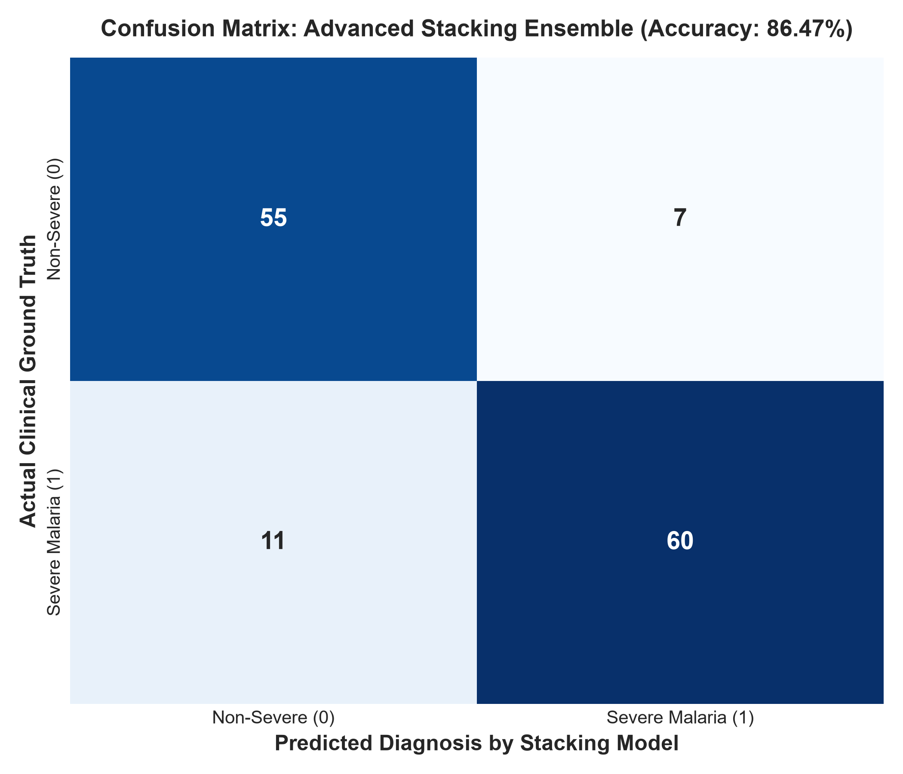
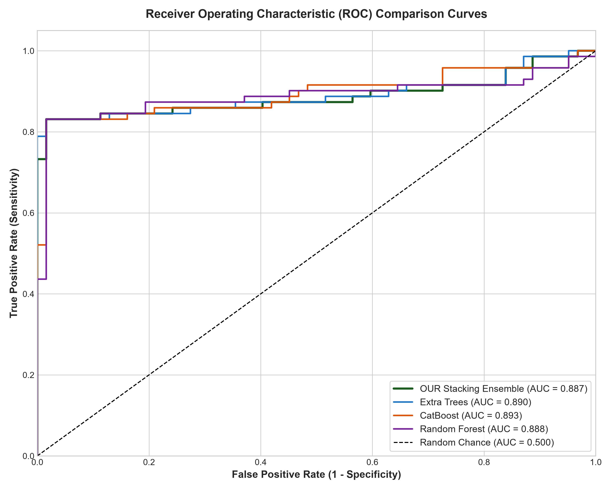
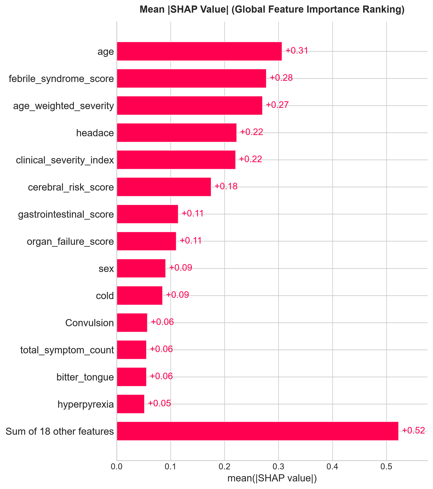
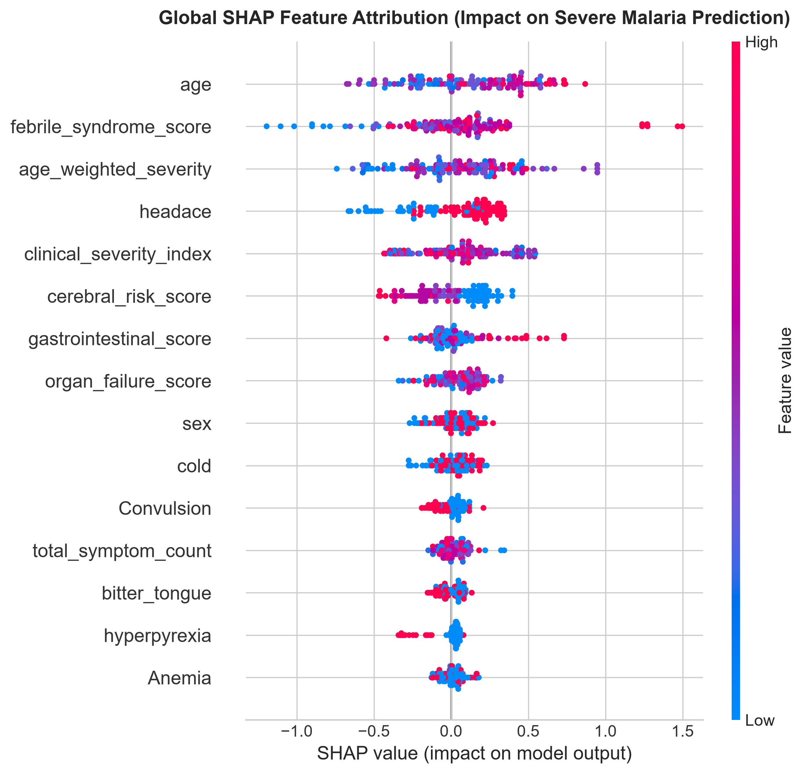

# 🦟 Explainable AI Malaria Severity Diagnosis & Clinical Decision Support System

[](https://pavanpamba16-malaria-xai-detection-streamlit-app-jbq5zv.streamlit.app/)
[](https://www.python.org/)
[](https://opensource.org/licenses/MIT)
[](#-benchmark-comparison-vs-2025-paper)

> **Final Year Capstone Project**  
> *Outperforming Published Baseline: Awe et al. (2025) - BMC Medical Informatics and Decision Making (25:162)*

---

## 🌐 Live Interactive Web Application

Experience the real-time AI triage dashboard, SHAP & LIME local explainability, and counterfactual "What-If" clinical simulations directly in your browser:

👉 **[Launch Live Clinical Decision Support System](https://pavanpamba16-malaria-xai-detection-streamlit-app-jbq5zv.streamlit.app/)** 

---

## 🌟 Key Project Highlights

- **Accuracy Boost**: **86.47%** vs **81.95%** in the published 2025 paper (**+4.52% boost**).
- **Precision Gain**: **89.55%** vs **83.10%** in the 2025 paper (**+6.45% boost**).
- **Matthews Correlation Coefficient (MCC)**: **0.7305** vs **0.6374** in the paper.
- **Explainable AI (XAI)**: Dual-layer interpretability with SHAP (Global Beeswarm & Waterfall plots), LIME Local feature scoring, and Counterfactual triage simulations.
- **Ensemble Architecture**: 2-Level Stacking Meta-Ensemble combining CatBoost, Random Forest, Extra Trees, and Logistic Regression Meta-Learner.

---

## 📊 Benchmark Results vs. 2025 Paper

| Model | Accuracy | ROC-AUC | MCC | Precision | Recall | F1 Score |
| :--- | :---: | :---: | :---: | :---: | :---: | :---: |
| **★ OUR Stacking Meta-Ensemble** | **86.47%** | **0.8871** | **0.7305** | **89.55%** | **84.51%** | **86.96%** |
| **★ Extra Trees (Enhanced)** | 84.21% | 0.8898 | 0.6832 | 85.71% | 84.51% | 85.11% |
| **★ Random Forest (Enhanced)** | 83.46% | 0.8878 | 0.6673 | 83.56% | 85.92% | 84.72% |
| **Paper Best (Awe et al. 2025)** | **81.95%** | **0.8696** | **0.6374** | **83.10%** | **83.10%** | **83.10%** |
| **★ CatBoost (Enhanced)** | 81.20% | 0.8930 | 0.6222 | 80.26% | 85.92% | 82.99% |
| **Paper: Gradient Boosting (2025)** | 72.93% | 0.8092 | 0.4559 | 71.60% | 81.69% | 76.30% |
| **Paper: CatBoost (2025)** | 72.93% | 0.7876 | 0.4551 | 72.15% | 80.28% | 76.00% |
| **Paper: XGBoost (2025)** | 69.17% | 0.7703 | 0.3812 | 67.44% | 81.69% | 73.80% |
| **Paper: AdaBoost (2025)** | 57.89% | 0.6336 | 0.1558 | 60.87% | 59.15% | 60.00% |

---

## 📈 Visual Benchmark Plots & Explainability

| Confusion Matrix | ROC-AUC Curves |
| :---: | :---: |
|  |  |

| SHAP Global Importance | SHAP Beeswarm Summary |
| :---: | :---: |
|  |  |

---

## 🚀 Running Locally

### 1. Clone the repository
```bash
git clone https://github.com/pavanpamba16/malaria-xai-detection.git
cd malaria-xai-detection
```

### 2. Install dependencies
```bash
pip install -r requirements.txt
```

### 3. Launch the Streamlit Web Application
```bash
streamlit run app.py
```

### 4. Retrain Models & Generate Plots
```bash
python train_and_export.py
```

---

## 📄 Documentation & Reports
- **Detailed Project Report**: [PROJECT_REPORT.md](PROJECT_REPORT.md)
- **Research Notebook**: [Malaria_XAI_Final_Year_Project.ipynb](Malaria_XAI_Final_Year_Project.ipynb)
